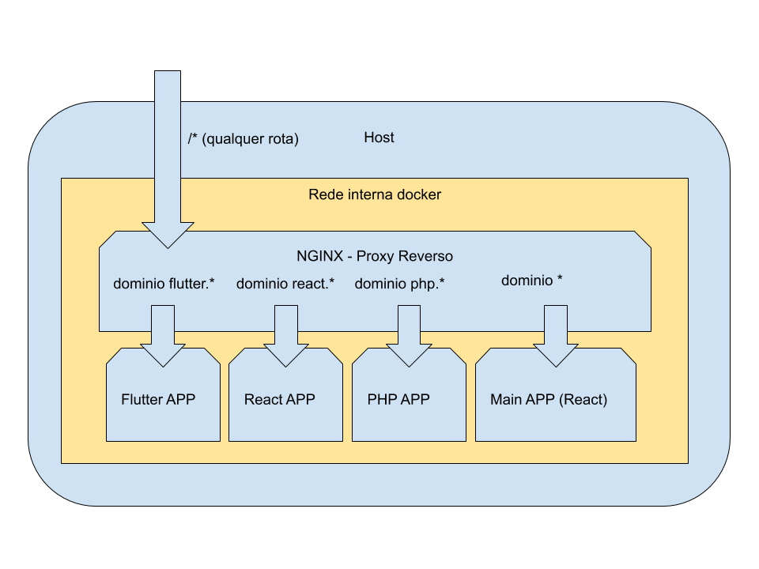

Esta aplicacao demonstra uma imlementacao basica do conceito de microfrontends

Durante os proximos dias e o objetivo fazer com que a aplicacao atenda os seguintes objetivos:

- ~~Implementar multiplas tecnologias sobre uma mesma interface~~
- Criar uma forma dinamica de (re)implantar os componentes da interface de maneira dinamica utilizando docker
- Compatilhar mesmos padroes de interface entre as diferentes tecnologias
- (Principal) Definir uma arquitetura de comunicacao entre as aplicacoes independente de tecnologias (backend / fronted)
- (Ideal) Fazer com que a aplicacao possa ser executada em diversas abas sem perder o contexto

# Rodando a aplicacao
Para executar a aplicacao e necessario ter os seguintes pre requisitos

- Docker

Apos basta abrir um terminal e executar o comando dentro do diretorio do repositorio:
```bash
$: docker-compose up
```
Isso ira criar as imagens necessarias para cada um dos componentes da aplicacao (Mais detalhes abaixo)

*Obs: Pode ser necessario uma alteracao no arquivo hosts para definir um dominio personalizado que redirecione para o endereco da aplicacao executando no docker. Para isso sera necessario editar o arquivo **/etc/hosts (no Mac/Linux)** ou o arquivo **C:/Windows/System32/drivers/etc/hosts (no Windows)** incluindo a linha:*

```bash
#IP_DA_MAQUINA_EXECUTANDO_OS_CONTAINERS_DOCKER NOME_DO_DOMINIO
#NO EXEMPLO ABAIXO O CONTAINER ESTA RODANDO NA MAQUINA LOCAL E
#MAPEAMOS PARA O DOMINIO example.com PARA O ENDERECO localhost
127.0.0.1 example.com
#O ARQUIVO HOSTS NAO ACEITA POR PADRAO A UTILIZACAO DE WILDCARDS (`*`)
#LOGO TODOS OS SUB-DOMINIOS ESPERADOS DEVEM SER LISTADOS
127.0.0.1 flutter.example.com
127.0.0.1 react.example.com
127.0.0.1 php.example.com

```

# Arquitetura
A arquitetura da infraestrutura da aplicacao implementada esta organizada da seguinte forma:

